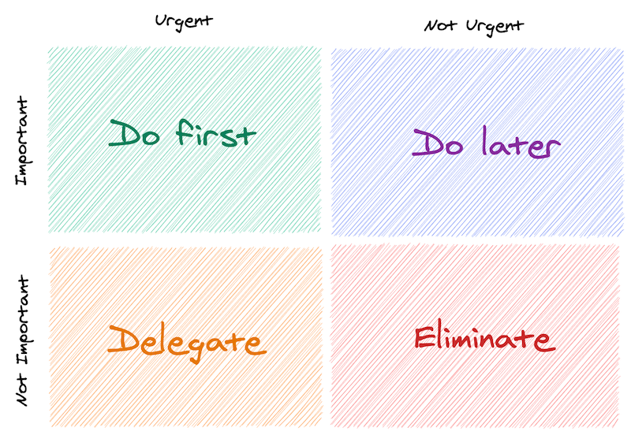
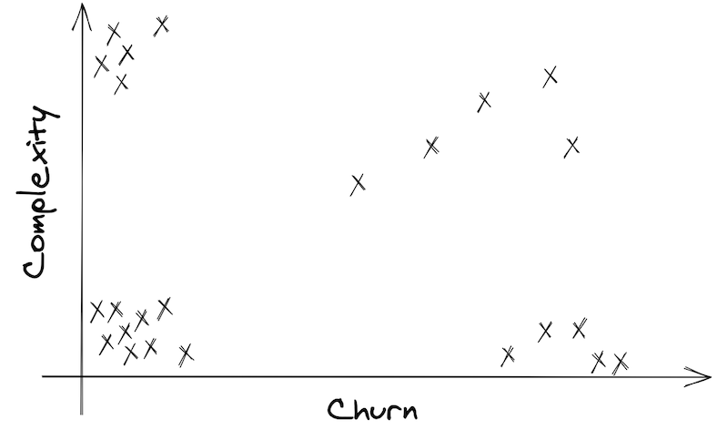
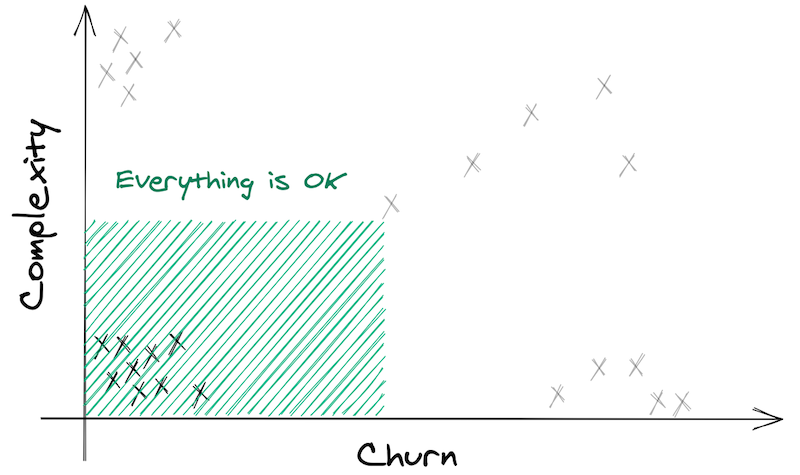
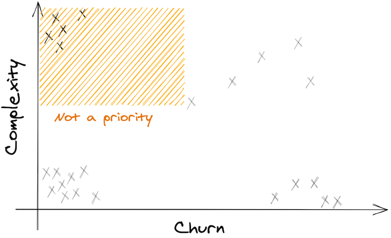
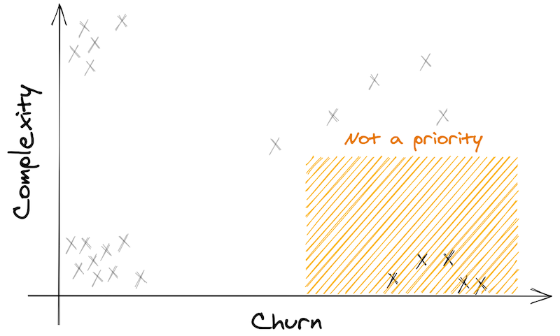
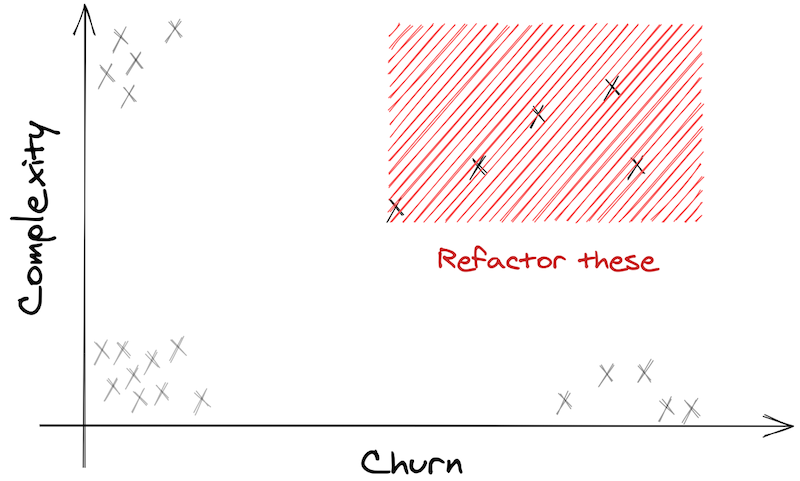
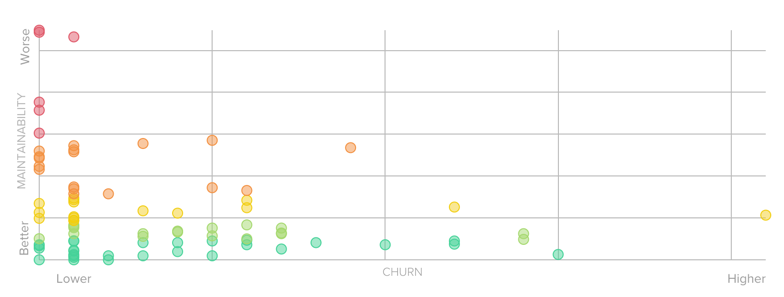
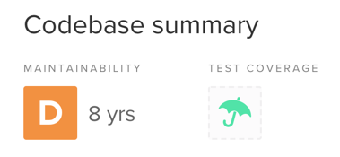
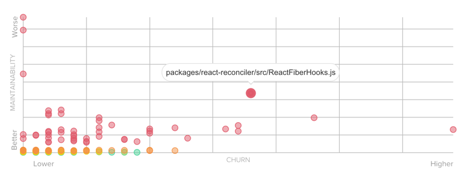
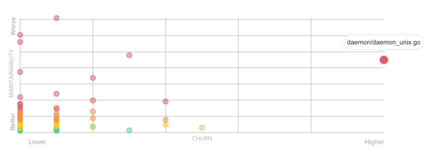

Did you ever have to deal with a codebase that felt unmaintainable?

The kind of codebase which looks like [the concept of "Tech Debt"](https://en.wikipedia.org/wiki/Technical_debt) was used as a guidebook. The kind of codebase where your code quality tooling says you've accumulated 8 years of technical debt 💥

Maybe that's the codebase you're working on today. Maybe you want to do something about it, but it's overwhelming! So what can you do?

## Eat the elephant, one bite at a time

It's the secret sauce behind recovering Legacy Code: **make it a little better every week**.

Legacy Code is not about good, it's about better.

Don't tackle all the issues at once. But do something. There's a balance to find. I bet you can't just stop delivering changes until you've cleaned the code. But you can solve little problems every time you implement a new feature or fix a bug.

Find a problem small enough to work on and ignore the other 100 problems. Rinse, repeat. After a few months, you'll start feeling a difference.

> "OK… but I'm not sure where to start!?"

Fair. Finding a problem to work on is easy: there are plenty!

But what problem will be worth solving first? Where should you start? Should you focus on the "critical" issues reported by your favorite static code analysis tool?

### Static code analysis can't help

Or at least: not alone.

A static code analysis will give you a bunch of metrics about your code quality. Notably, the code complexity. There are many ways to measure it. [Cyclomatic complexity](https://en.wikipedia.org/wiki/Cyclomatic_complexity) is a popular one.

The problem when you run static code analysis on a large legacy codebase is that it will report _countless_ issues to address.

Consequently, you will try to fine-tune the settings to report fewer problems. Then, you will ignore the "regular" and "important" issues to focus on the "critical" ones. Still, you will have hundreds of them to address and that's not helping…

**When everything is urgent, nothing is!**

That's a well-known concept. When it comes to productivity techniques, we have ways to deal with it.

For example, [the Eisenhower matrix](https://www.eisenhower.me/eisenhower-matrix/) helps you decide on and prioritize tasks by urgency and importance:



We basically need that, but for technical debt.

## Churn vs. Complexity = Hotspots

Now that you know "Complexity", let me introduce you to "Churn".

**Churn is the number of times a file has changed.**

Where do you find that information? In your version control system. If you use git, then you have a mine of metadata that you can leverage!

To effectively prioritize technical debt, you need to know what is "important" AND "urgent". That's why you need to measure both Complexity AND Churn.

Say you get a Complexity and a Churn score for each file of your codebase. Put them in a _Churn vs. Complexity_ graph:



Tadaaa, here's your prioritization matrix! Can you see the 4 quadrants?

## The 4 quadrants

### 1) Simple files, barely touched

On the bottom-left are the files that are easy to maintain and not often touched. That's a happy place.

Obviously, you don't have to refactor these 👐



### 2) Complex files, not often touched

The top-left corner is interesting. These are the files that are quite complex already. Really messy.

**But they don't change often!** They are stable, so to speak.

> "If the code never changes, it's not costing us money"
>
> — Sandi Metz

Therefore, these files are not a priority.



I recommend you forget about these. **DON'T refactor them!**

### 3) Simple files that frequently change

On the bottom-right, you have files that are easy to maintain.

Nothing to worry about. But it's interesting to note that you're changing them frequently. Maybe these are configuration files?

In any case, there's nothing to do. Forget about them too!



### 4) Complex files that are constantly changing

On the top-right corner are the problematic files. The ones that hurt. They are complex. And they are frequently touched.

**This is your priority!**



Usually, they are at the heart of your business. You'll likely find main controllers or core classes that have become [God Objects](https://en.wikipedia.org/wiki/God_object).

> Focus on the top-right quadrant, forget the rest

With a Hotspots analysis, you can filter the noise and prioritize the refactoring efforts 👍

## How do you generate this graph?

There are 3 things to do for a Hotspots analysis:

1. Calculate the Complexity score of each file
2. Calculate the Churn score of each file
3. Create a Churn vs. Complexity graph with these data

### Calculate the Complexity score of each file

The truth is, any complexity metric will do.

If you have a tool in your language that calculates the Cyclomatic Complexity of your codebase, use that.

If you're using some tool like [SonarQube](https://www.sonarqube.org/), use that.

What you want is a score per filename. The higher the score, the more complex it is.

Pick the 50 highest scores. You're done.

### Calculate the Churn score of each file

Use your version control system. It contains all the data you need.

Also, you don't really need to retrieve the history since the beginning of the project. Limit the analysis to the last 12 months, it's good enough.

If you're using git, the following command will get you what you need:

```shell
git log --format=format: --name-only --since=12.month \
 | egrep -v '^$' \
 | sort \
 | uniq -c \
 | sort -r \
 | head -50
```

Copy-paste this in your project repository and you'll get the 50 most changed files since last year!

Let's decompose the command quickly, so you understand it:

- `git log` is the git command to get logs data, a gold mine 💰
  - `--format=format:` to remove all fancy formatting
  - `--name-only` because we only care about file names
  - `--since=12.month` is quite explicit
- `egrep -v '^$'` removes all empty lines from the output
- `sort` to sort file names alphabetically
- `uniq -c` to count individual file names occurrences
- `sort -r` to sort the result in descending order
- `head -50` to keep the 50 most changed files only

Tweak it if you need to ignore some patterns (e.g. XML or JSON files).

That's it, you're done.

### Create a Churn vs. Complexity graph

Pick your favorite spreadsheet software and make a graph from these 2 sets of data.

Each file name is a point that has 2 scores, which represent x and y.

If a file misses one score, you can omit it. It's either a simple file or barely changed.

A dataviz solution like [Google Visualization](https://developers.google.com/chart/interactive/docs/gallery/scatterchart) works fine too!

### Existing tools you can use

Regarding your language, there might exist a solution that can automate that work for you.

Here are a few:

- [Code Climate](https://docs.codeclimate.com/docs/churn) provides this graph, among other metrics. It's free for open-source software.
- [CodeScene](https://codescene.io/docs/guides/technical/hotspots.html) does the same, with a different type of visualization. It's also free for open-source!
- [churn_vs_complexity](https://github.com/jrafanie/churn_vs_complexity) generates the graph for Ruby codebases
- [churn-php](https://github.com/bmitch/churn-php) gives you the combined score to prioritize tech debt for PHP codebases
- [code-complexity](https://github.com/simonrenoult/code-complexity) is a node-module that also gives you the combined score but is language agnostic

## The ideal shape

A sane codebase should tend to cluster files around a line that goes from the top-left quadrant to the bottom-right one.

It never goes into the top-right quadrant.


Files that are far from this line are the outliers you should focus on.

### Examples in the wild

Here is an example from Code Climate of a quite maintainable codebase I used to work with:



If you consider the [React.js](https://github.com/facebook/react/) project, the static analysis will depict a depressing situation: 8 years to clean all the technical debt accumulated!



However, the Churn vs. Complexity analysis could help the team prioritize what would actually be worth refactoring:



Same observation for [the Docker engine](https://github.com/docker/engine):



I don't know the codebase much, but I'm convinced that refactoring `daemon/daemon_unix.go` is the most efficient thing to do to simplify further developments.

## Do it, analyze your codebase!

Take some time to:

1. Calculate the Complexity score of each file
2. Calculate the Churn score of each file
3. Create a Churn vs. Complexity graph with these data

Identify your Hotspots in the top-right quadrant.

Then present the results to your team and discuss. This is where the magic happens.
