How do you analyze a very large Legacy codebase?

Where do you start when your system is distributed across dozens of micro-services?

How do you identify development bottlenecks and prioritize refactoring?

In his book [Software Design X-Rays](https://www.google.com/search?q=software+design+x-rays&oq=soft), Adam Tornhill presents a very unique approach to answer these questions. It's a mix of software architecture and human psychology that generates powerful techniques to tackle large codebases.

Yet, I realized it's not a very known book.

> I've read [Your Code as a Crime Scene](https://www.google.com/search?q=your+code+as+a+crime+scene) from the same guy. How is this different?

Well, "Software Design X-Rays" was written after "Your Code as a Crime Scene". While the forensics flavor of the book was fun and all, Adam stopped referring it too much to avoid getting the reader distracted. The content is much more polished!

Let me give you my summary of what's inside the book and why I think it can help you:

## Tackle Technical Debt with Behavioral Code Analysis

The book focuses on giving you the answers to these 3 questions:

1. Where's the code with the higher interest rate?
2. Does your architecture support the way your system evolves?
3. Are there any productivity bottlenecks for inter-team coordination?

To do so, Adam presents a technique called **Behavioral Code Analysis**. It uses the information contained in your Version Control System (VCS) to help you make smart decisions on large codebases.

### Identify your system Hotspots

Technical Debt isn't really a problem if you don't have to maintain it.

Static analysis tools consider all debt to be equivalent. They report countless of code smells that you have no choice but to focus on the critical ones. Still, that leaves plenty of things to clean up!

That's why you should use the time dimension to identify **Hotspots**: places where you should focus the Refactor efforts in a large codebase if you want to be super effective.

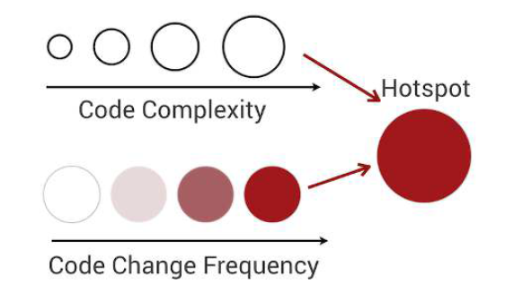

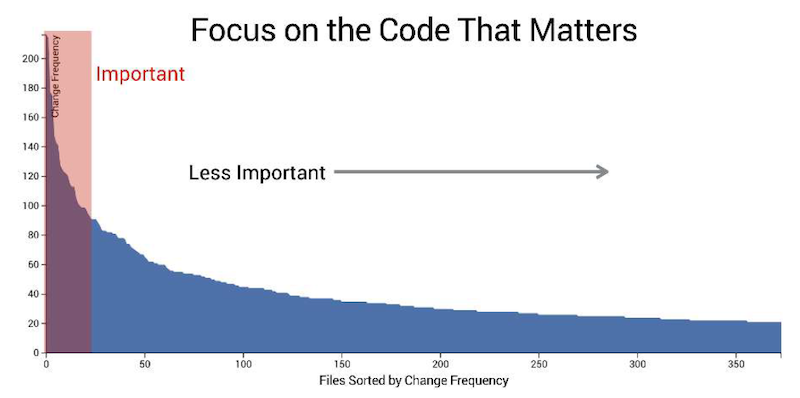

If you want to learn how to generate and use these, I presented the technique in details:

- [Focus refactoring on what matters with Hotspots Analysis](../focus-refactoring-with-hotspots-analysis)
- [Convince managers to address Tech Debt with Enclosure Diagrams](../convince-management-to-address-tech-debt-with-enclosure-diagrams)

Interestingly, hotspots tend to stay here because people are afraid to tackle them. So they attract even more complexity and become problematic bottlenecks.

### LOC: a simple and efficient indicator of code complexity

When it comes to evaluating the complexity of the code, many metrics compete. The most popular is probably Cyclomatic Complexity. Yet, it's fascinating to see that the count of Lines Of Code (LOC) is often a _good enough_ indicator!

As it's a language-neutral metric, it's very easy to generate regardless of your language tooling. You can use [cloc](http://cloc.sourceforge.net/) for that:

```bash
cloc . --csv --quiet --report-file=your_project.csv
```

Another language-neutral metric that works well is the **Indentation Level**. Indentation carries the meaning of logical splits. That's a good indicator that code is complex.

The limit of using these is when you have a change in the coding style in the history of the project. But because these metrics are simple, it makes no sense to look at specific values and thresholds. **It's the trend that matters**. That's usually enough.

### Evaluate Hotspots with Complexity Trends

If you analyze the evolution of complexity of a file over time, you get the story of that file:


That's helpful to show the impact of refactoring to non-technical managers. That helps them visually see the effects of such work, and the results on team productivity.

### Perform X-Rays analysis to narrow even deeper

Once you identified Hotspots, you can apply the same logic at the file level to find the complex functions:

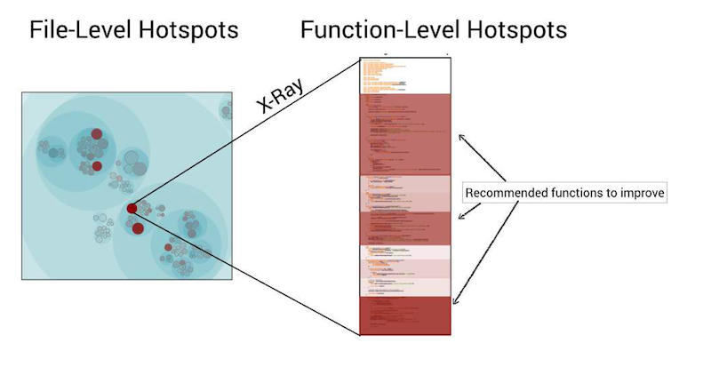

This is what Adam calls "X-Ray analysis". Here's the rough recipe:

1. Fetch the source code of the file for each revision from Git
2. Run a `git diff` for every revision to list the modifications
3. Match the `diff` results to the functions that existed in this version (parsing the code is necessary here)
4. Perform a Hotspot calculation for the functions
   - Change Frequency = times a function was changed
   - Complexity = length or indentation level of the function
   - Combine them to calculate the score


With the Hotspot + X-Ray techniques, you can take a 400kLOC codebase and focus on the few hundred lines of code that will have the most impact if they are refactored.

It's good to know you can perform a cheap X-Ray with git log, using the `-L` option:

```bash
git log -L:intel_crtc_page_flip:drivers/gpu/drm/i915/intel_display.c
```

## Coupling in Time: where surprises happen

You generally forget about the time dimension when you analyze the code to evaluate its design. That's a mistake! **Change Coupling** is when files change together over time.

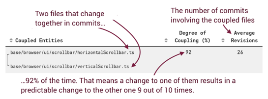

2 files might change together accidentally. But if they changed together in many commits, with a high degree of coupling, then there's a high chance these 2 files are coupled!

This allows you to identify things that empirically belong together. If these files are not co-located, then there might be a problem with the current design. Maybe there's a bad abstraction or maybe there's copy-pasted code that keeps evolving together.

Expected coupling:

- highly-cohesive files (same module)
- code & tests

Unexpected coupling:

- low-cohesive files (different modules)
- surprising relationships

Since you're using git metadata to determine these coupling, it's **language agnostic**. Therefore, you can detect coupling across stacks, like between front-end and back-end.

A limit of this technique is the commit patterns developers use. If a developer always commits tests and code independently, you can adapt the technique and consider commits from the same author in a 24h sliding window as "coupled together". Usually, that's good enough.

### Identify actual code duplication

Copy-paste is not bad in itself.

It's only bad if you need to keep changing all occurrences together. Hence, if you integrate a metric of _Similarity_ in your Change Coupling analysis, you can detect problematic copy-paste:

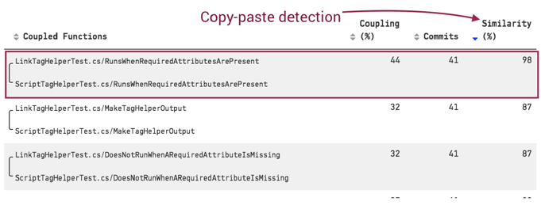

Fixing code duplication is often a quick win. It helps getting started in refactoring a Hotspot.

As a rule of thumb: **things that are coupled should be co-located**.

## The Principles of Code Age

Code is only desirable in 2 states:

1. Very recent, because it's fresh in your mind
2. Very old, because it means it has stabilized

When you meet a very old code, you can encapsulate that into a library and extract it from your codebase. That's less code to deal with, which is good for developers and onboarding!

**Old code usually has no bugs.**

A code that doesn't stabilize is problematic. It usually means you need to patch it. Because you don't know it very well, there's a high chance of creating bugs by ignorance. By creating more bugs, you need to update the code again: it doesn't stabilize.

### Calculate the age of code

The algorithm is simple:

1. List modified files with `git ls-files`
2. Get the last modification date for each file with `git log -l --format="%ad" --date=short -- path/to/file`
3. Calculate the age of the file

If the codebase was not maintained for some time, consider the youngest one to be 0.

### Refactor towards code of similar age

Within the same packages, you can identify the code of different ages (very old AND very recent). Try to understand why some code fails to stabilize.

Maybe you'll be able to extract parts of it that would actually stabilize.

Maybe you'll identify different concepts that are mixed. So you can refactor the structure of the code:

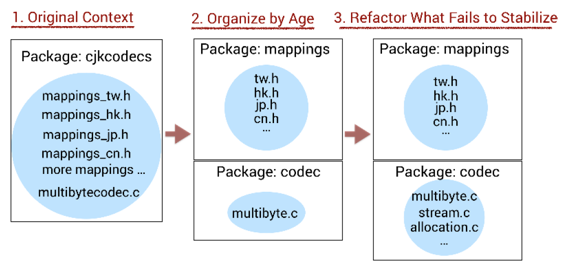

## Beyond Conway's Law

### Development Congestion

When you put too many developers on the same code, it's hard to keep productive. That's because the code constantly changes: the code you wrote three days ago is now different, so you have to constantly re-discover what it does. The risk of bug is high.

This is _Development Congestion_.

That's why if you put more people on a late project, the project will be even later.

Code reviews and automated tests can mitigate the risk of bugs.

### The problem of having too many contributors

**Many minor contributors you have in the last 3 months = higher chances to have bugs**.

That's because contributors don't have the full context of what they change.

With many contributors, _diffusion of responsibility_ makes the codebase rot because each developer thinks someone else will take care of refactoring.

Also, many contributors lead to _process loss_ (waste) due to communication overhead.

Thus, you need to introduce **areas of responsibility** to give teams full ownership. Other teams may contribute through PRs, but one team should own their part, be involved in reviews, and have the final word.

Finally, **teams should have a broader knowledge boundary (what they know) than their operational boundary (what they change)**. You can make that happen with:

- Teams demoing what they're working on
- Inter-teams code reviews to spread knowledge
- Make people move between teams

### Calculating the Diffusion score

You can count the number of developers on a specific part of the code from git:

```bash
git shortlog -s --after=2020-01-12 -- some/module/path | wc -l
```

If you analyze the distribution of contributions on a part of the code, you get a _Diffusion_ score:

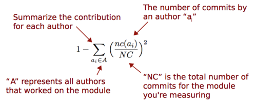
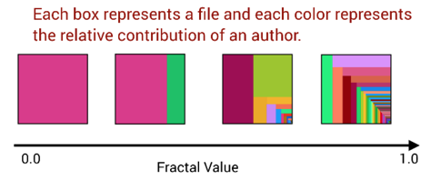

You can generate an enclosure diagram to identify bottlenecks in your large codebase:

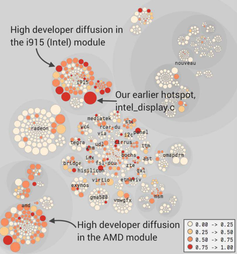

### Keep a decision log

[Architecture Decision Record (ADR)](../earn-maintainers-esteem-with-adrs) are very useful to simply keep track of architectural decisions in the project.

They help people understand why and how decisions were taken in the past. This is useful to re-evaluate them later in the project, as well as spreading knowledge.

### A few management pitfalls

Adam gives a few pieces of advice to managers, referring to human psychology. Whether you're a Tech Lead or a non-technical manager, these are gold.

First, you should never make people feel their contributions are dispensable. E.g. don't cancel what they've been working on at the last minute. This leads to _Motivation loss_.

Also, if people feel that the team's success depends little on their actual efforts, they will just pretend to work and expect others to do the job. That's _Social Loafing_.

Therefore, you should never set arbitrary goals or deadlines. **Always explain "why"**.

Finally, **don't use Behavioral Code metrics as an individual performance evaluation**. If you do so, people will game the metrics. That will ruin the productivity and collaboration. Thus, you won't be able to use these metrics anymore. Not smart!

5 things that generally help:

1. Small groups like 4-5 people
2. Good code reviews
3. Leadership by example
4. Visibility of each individual contributions, acknowledging personal achievements
5. Foster inter-teams coffee breaks and lunches

### Anti-pattern: a dedicated maintenance team

I found this one interesting because it's so common.

The thing is, having a dedicated maintenance team brings a few issues that are detrimental to productivity:

- Motivation loss, because it's not a fun job
- Low in-group cohesion, because teamwork is spread across the codebase, no mastery
- A broken feedback loop for the team introducing a bug
- Expensive coordination needs between this team and all the others
- Diffusion of responsibility for other developers, who tend to create more bugs

Personally, I usually recommend making the development team responsible for finding and fixing bugs. It's OK to have people specialized in testing, but it's better if they work closely with the developers.

### Draw the Knowledge Map of your system

Remember the Diffusion score? You can do the same, but count **the number of lines added** instead of the number of commits. That gives you a % of contribution per author.

You don't want to know where people work the most, but who did the most contributions.

Git log can give use that with `--numstat`. With this, you can draw a _Knowledge Map_:

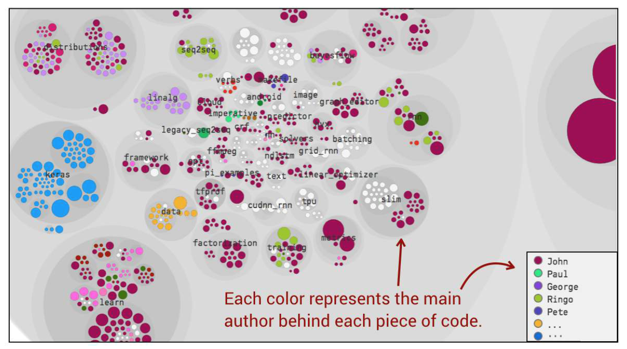

That is helpful when you need to build up the best team of individuals who know the code you need to refactor.

You can also prioritize the Knowledge Transfer when a developer leaves. Identify parts they are the main contributors to and that are important for the company.

Of course, you can map individuals to teams to get a higher-level vision:

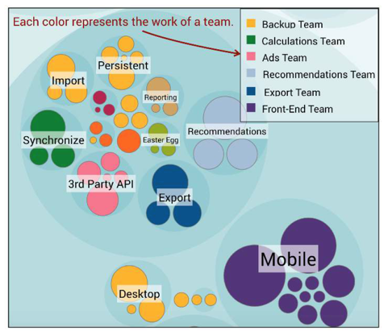

That allows you to identify organizational misalignments with your architecture. The idea is to set up top-level boundaries that match what the team has been working on.

The limit of this analysis depends on your commit strategy. **If you can't trust the git commit author, then don't use it.** For example, a squash-and-merge strategy drops the contributions of multiple authors. In this case, focus on the "Teams" view or limit your analyses to technical ones (Hotspots).

If you want to learn how to generate these, I presented the technique in details:

- [Identify who to ask for help with Knowledge Maps](../identify-who-to-ask-with-knowledge-maps/)

## Conclusion

As you can see, Adam Tornhill gives a bunch of techniques to get precious information out of large codebases.

You can apply these techniques at the architecture level as well. It works on distributed systems, across micro-services: simply combine the results of each analysis into a bigger one.

That's really powerful to get a grasp and concrete actions on very large systems. That's a super toolbox for Legacy Code!

Finally, you can also use these metrics to proactively detects rising Technical Debt that would because of a problem. Imagine this: you can _anticipate_ a sudden increase in the Complexity Trend or a rising Hotspot if a PR gets merged! This would be the perfect time to address the issue, while it's still fresh and hypothetic.

> Do I need to read the book now that you gave me a summary?

Yes, you should. It worth it. I only scratched the surface here. And I believe this is very valuable knowledge.

Adam gives concrete exercises for you to practice at the end of every chapter.

If you're mostly interested in trying this out, I have to mention that:

- Adam has published an open-source tool to generate most of the metrics presented here: [code-maat](https://github.com/adamtornhill/code-maat)
- All of these concepts have been put inside Adam's product: [CodeScene](https://codescene.io/). It's free for open-source and gives you every analysis described in this book.

I use these techniques to identify the best things to do when I approach a Legacy codebase. If you liked this summary, you'll enjoy [the book](https://www.google.com/search?q=software+design+x-rays).

Aaaaand you'll _love_ the content I publish every week! 🤠

Subscribe to my newsletter to receive my Legacy Code tips & tricks, directly in your inbox, every Wednesday.

Take care out there!
