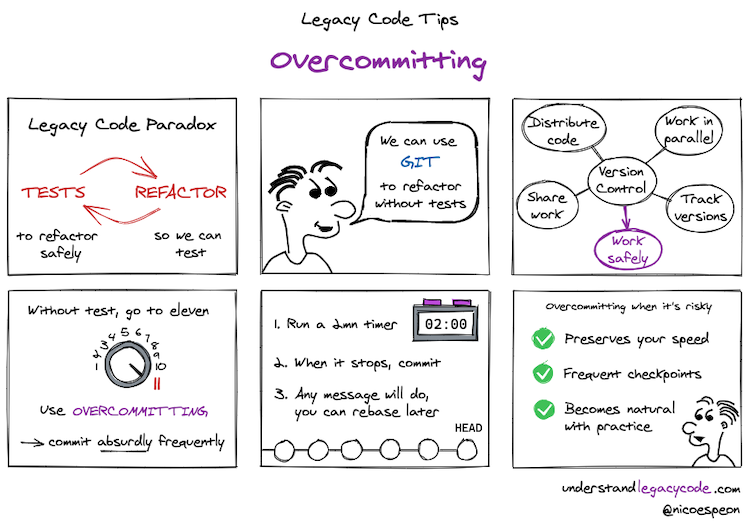

_Get this comic in SVG + high-res PNG by subscribing to my weekly newsletter at the bottom of this post 👇_

I'm sure you've got into this paradox:

- People tell you to write tests _before_ you refactor, so you know if you break something
- But the code is so messy that you need to refactor it _before_ you can write tests

It sounds like a [chicken-and-egg problem](https://en.wikipedia.org/wiki/Chicken_or_the_egg). Where do you even start?

Well, usually you don't have the luxury to wait until you find out. You estimated this issue would take 2 days and now this estimation has turned into a commitment. So you fall back to what you know to do: changing the code, trying not to do any mistake, and testing manually a few common scenarios to verify everything is still working.

If that's you, I have a technique for you that will preserve your speed and make your changes safer. Mastering it will make you go faster when things are blurry. You'll be a [speedrunner](https://fr.wikipedia.org/wiki/Speedrun) through the maze of Legacy Code.

If you're versioning your code, you already have the tool you need. If you're not, I suggest [you install git](Thttps://git-scm.com/downloads), run `git init` in your source code repository, commit everything, and start from here.

## How overcommitting can help

Among all the benefits of source code version control, one is to save the state of your code at different moments of the development. This is what you do when you commit. It allows you to go back to a previous state (commit) if needed.

Commits are like checkpoints. When the game is particularly difficult, having more checkpoints helps.

When you realize you did something wrong, commits allow you to go back to a state where things were still working, so you can revisit your changes or try again.

When you don't have automated tests, the feedback loop is notoriously longer. You won't know if you break something until a few minutes, maybe even hours. If you commit as you use to do, you'll lose dozen of minutes of code, if I'm being optimistic.

But if you were committing every minute or so, you would have many more checkpoints to start from. You'd be able to find out precisely when things got sour, and start from here!

**Overcommitting allows you to work safely.**

## What does it look like

When change is risky, think about committing often. Then, commit even more than that!

You need to commit absurdly frequently. If it feels stupidly frequent, you're doing it right.

You're not used to committing that often. So you need to deliberately push yourself out of your habits to build a new one.

As you can't both think carefully about the code and think carefully about committing, I recommend you use a timer. 2 minutes is a good chunk to get started. In my experience, developers commit way less often than that.

1. Start a 2 minutes timer.
2. When it rings, commit what you have.
3. Repeat.

It's designed to be a short loop. You must repeat this again and again during your whole coding session.

**Don't bother with the commit message yet.** That will feel wrong, but that's normal. You can't come up with a good name if you commit everything you have every 2 minutes (or you'd be very lucky). The goal is to do safe changes for the moment, focus on that.

If you're worried commits won't pass the review, I advise you to take 5min at the end of each hour to [squash your commits together](http://gitready.com/advanced/2009/02/10/squashing-commits-with-rebase.html) and give them more appropriate messages. You should have ~30 small commits to rebase, which shouldn't take long.

## Why does it work?

The obvious reason is that you create much, much more checkpoints. It makes it easier to detect the exact moment a bug was introduced. You waste less time debugging when you realize there's a problem.

Because you don't focus on the commit message while you're committing, it preserves your speed. The time is taking care of telling you to commit. When it rings, you just do that and move on.

But there's more, and it has to do with safety.

J. B. Rainsberger told me this recently: _why do we have breaks on a car?_

Most people will tell you that's so you can stop. The truth is: **that's so you can go fast**! If there were no breaks, you would drive slowly and carefully because you can't react promptly to what's around the corner. Breaks give you the power to go faster because you can react to obstacles.

If you have automated tests, you'll refactor the code more because you know it's safe to do it. If you don't have them, you'll not feel comfortable changing the code and try to work around as much as you can, usually making things worse.

Sometimes, refactoring the code is necessary so you can add some tests. Sometimes also, you don't know how to test this code but you still have to change it before tomorrow. In these cases, overcommit will bring you enough safety so you can work faster!

Finally, the time you'd have saved would be wisely re-invested in writing the automated tests you're missing!

**Don't forget to grab your Overcommitting Comic!**
